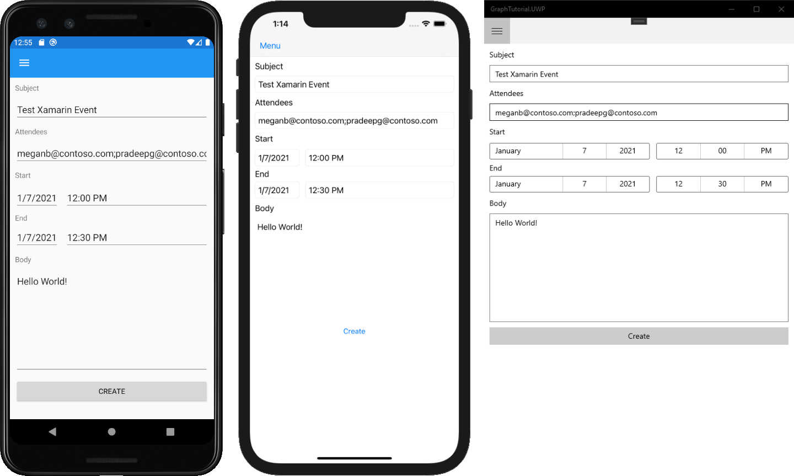

<!-- markdownlint-disable MD002 MD041 -->

<span data-ttu-id="a028f-101">Dans cette section, vous allez ajouter la possibilité de créer des événements sur le calendrier de l’utilisateur.</span><span class="sxs-lookup"><span data-stu-id="a028f-101">In this section you will add the ability to create events on the user's calendar.</span></span>

1. <span data-ttu-id="a028f-102">Ajoutez une nouvelle page pour le nouvel affichage d’événement.</span><span class="sxs-lookup"><span data-stu-id="a028f-102">Add a new page for the new event view.</span></span> <span data-ttu-id="a028f-103">Cliquez avec le bouton droit **sur le projet GraphTutorial** dans l’Explorateur de solutions et sélectionnez **Ajouter > nouvel élément...**. Choose **Blank Page**, enter in the `NewEventPage.xaml` **Name** field, and select **Add**.</span><span class="sxs-lookup"><span data-stu-id="a028f-103">Right-click the **GraphTutorial** project in Solution Explorer and select **Add > New Item...**. Choose **Blank Page**, enter `NewEventPage.xaml` in the **Name** field, and select **Add**.</span></span>

1. <span data-ttu-id="a028f-104">Ouvrez **NewEventPage.xaml** et remplacez son contenu par ce qui suit.</span><span class="sxs-lookup"><span data-stu-id="a028f-104">Open **NewEventPage.xaml** and replace its contents with the following.</span></span>

    :::code language="xaml" source="../demo/GraphTutorial/GraphTutorial/NewEventPage.xaml" id="NewEventPageXamlSnippet":::

1. <span data-ttu-id="a028f-105">Ouvrez **NewEventPage.xaml.cs** et ajoutez les `using` instructions suivantes en haut du fichier.</span><span class="sxs-lookup"><span data-stu-id="a028f-105">Open **NewEventPage.xaml.cs** and add the following `using` statements to the top of the file.</span></span>

    :::code language="csharp" source="../demo/GraphTutorial/GraphTutorial/NewEventPage.xaml.cs" id="UsingStatementsSnippet":::

1. <span data-ttu-id="a028f-106">Ajoutez **l’interface INotifyPropertyChange** à la **classe NewEventPage.**</span><span class="sxs-lookup"><span data-stu-id="a028f-106">Add the **INotifyPropertyChange** interface to the **NewEventPage** class.</span></span> <span data-ttu-id="a028f-107">Remplacez la déclaration de classe existante par ce qui suit.</span><span class="sxs-lookup"><span data-stu-id="a028f-107">Replace the existing class declaration with the following.</span></span>

    ```csharp
    [XamlCompilation(XamlCompilationOptions.Compile)]
    public partial class NewEventPage : ContentPage, INotifyPropertyChanged
    {
        public NewEventPage()
        {
            InitializeComponent();
            BindingContext = this;
        }
    }
    ```

1. <span data-ttu-id="a028f-108">Ajoutez les propriétés suivantes à **la classe NewEventPage.**</span><span class="sxs-lookup"><span data-stu-id="a028f-108">Add the following properties to the **NewEventPage** class.</span></span>

    :::code language="csharp" source="../demo/GraphTutorial/GraphTutorial/NewEventPage.xaml.cs" id="PropertiesSnippet":::

1. <span data-ttu-id="a028f-109">Ajoutez le code suivant pour créer l’événement.</span><span class="sxs-lookup"><span data-stu-id="a028f-109">Add the following code to create the event.</span></span>

    :::code language="csharp" source="../demo/GraphTutorial/GraphTutorial/NewEventPage.xaml.cs" id="CreateEventSnippet":::

1. <span data-ttu-id="a028f-110">Enregistrez vos modifications et exécutez l’application.</span><span class="sxs-lookup"><span data-stu-id="a028f-110">Save your changes and run the app.</span></span> <span data-ttu-id="a028f-111">Connectez-vous, sélectionnez **l’élément** de menu  Nouvel événement, remplissez le formulaire et sélectionnez Créer pour ajouter un événement au calendrier de l’utilisateur.</span><span class="sxs-lookup"><span data-stu-id="a028f-111">Sign in, select the **New event** menu item, fill in the form, and select **Create** to add an event to the user's calendar.</span></span>

    
